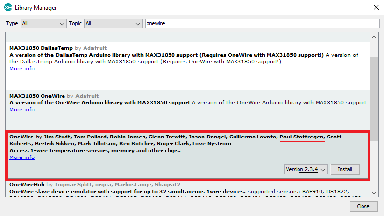

<html xmlns:v="urn:schemas-microsoft-com:vml"
xmlns:o="urn:schemas-microsoft-com:office:office"
xmlns:w="urn:schemas-microsoft-com:office:word"
xmlns:m="http://schemas.microsoft.com/office/2004/12/omml"
xmlns="http://www.w3.org/TR/REC-html40">

<head>
<meta http-equiv=Content-Type content="text/html; charset=unicode">
<meta name=ProgId content=Word.Document>
<meta name=Generator content="Microsoft Word 15">
<meta name=Originator content="Microsoft Word 15">
<link rel=File-List href="README.md.fld/filelist.xml">
<link rel=Edit-Time-Data href="README.md.fld/editdata.mso">
<!--[if !mso]>

<![endif]--><!--[if gte mso 9]><xml>
 <o:DocumentProperties>
  <o:Author>Marek Urbaniak</o:Author>
  <o:LastAuthor>Marek Urbaniak</o:LastAuthor>
  <o:Revision>2</o:Revision>
  <o:TotalTime>76</o:TotalTime>
  <o:Created>2020-11-02T17:28:00Z</o:Created>
  <o:LastSaved>2020-11-02T17:28:00Z</o:LastSaved>
  <o:Pages>1</o:Pages>
  <o:Words>763</o:Words>
  <o:Characters>4580</o:Characters>
  <o:Lines>38</o:Lines>
  <o:Paragraphs>10</o:Paragraphs>
  <o:CharactersWithSpaces>5333</o:CharactersWithSpaces>
  <o:Version>16.00</o:Version>
 </o:DocumentProperties>
 <o:OfficeDocumentSettings>
  <o:AllowPNG/>
 </o:OfficeDocumentSettings>
</xml><![endif]-->
<link rel=themeData href="README.md.fld/themedata.thmx">
<link rel=colorSchemeMapping href="README.md.fld/colorschememapping.xml">
<!--[if gte mso 9]><xml>
 <w:WordDocument>
  <w:SpellingState>Clean</w:SpellingState>
  <w:GrammarState>Clean</w:GrammarState>
  <w:TrackMoves>false</w:TrackMoves>
  <w:TrackFormatting/>
  <w:HyphenationZone>21</w:HyphenationZone>
  <w:PunctuationKerning/>
  <w:ValidateAgainstSchemas/>
  <w:SaveIfXMLInvalid>false</w:SaveIfXMLInvalid>
  <w:IgnoreMixedContent>false</w:IgnoreMixedContent>
  <w:AlwaysShowPlaceholderText>false</w:AlwaysShowPlaceholderText>
  <w:DoNotPromoteQF/>
  <w:LidThemeOther>PL</w:LidThemeOther>
  <w:LidThemeAsian>X-NONE</w:LidThemeAsian>
  <w:LidThemeComplexScript>X-NONE</w:LidThemeComplexScript>
  <w:Compatibility>
   <w:BreakWrappedTables/>
   <w:SnapToGridInCell/>
   <w:WrapTextWithPunct/>
   <w:UseAsianBreakRules/>
   <w:DontGrowAutofit/>
   <w:SplitPgBreakAndParaMark/>
   <w:EnableOpenTypeKerning/>
   <w:DontFlipMirrorIndents/>
   <w:OverrideTableStyleHps/>
  </w:Compatibility>
  <w:BrowserLevel>MicrosoftInternetExplorer4</w:BrowserLevel>
  <m:mathPr>
   <m:mathFont m:val="Cambria Math"/>
   <m:brkBin m:val="before"/>
   <m:brkBinSub m:val="&#45;-"/>
   <m:smallFrac m:val="off"/>
   <m:dispDef/>
   <m:lMargin m:val="0"/>
   <m:rMargin m:val="0"/>
   <m:defJc m:val="centerGroup"/>
   <m:wrapIndent m:val="1440"/>
   <m:intLim m:val="subSup"/>
   <m:naryLim m:val="undOvr"/>
  </m:mathPr></w:WordDocument>
</xml><![endif]--><!--[if gte mso 9]><xml>
 <w:LatentStyles DefLockedState="false" DefUnhideWhenUsed="false"
  DefSemiHidden="false" DefQFormat="false" DefPriority="99"
  LatentStyleCount="375">
  <w:LsdException Locked="false" Priority="0" QFormat="true" Name="Normal"/>
  <w:LsdException Locked="false" Priority="9" QFormat="true" Name="heading 1"/>
  <w:LsdException Locked="false" Priority="9" SemiHidden="true"
   UnhideWhenUsed="true" QFormat="true" Name="heading 2"/>
  <w:LsdException Locked="false" Priority="9" SemiHidden="true"
   UnhideWhenUsed="true" QFormat="true" Name="heading 3"/>
  <w:LsdException Locked="false" Priority="9" SemiHidden="true"
   UnhideWhenUsed="true" QFormat="true" Name="heading 4"/>
  <w:LsdException Locked="false" Priority="9" SemiHidden="true"
   UnhideWhenUsed="true" QFormat="true" Name="heading 5"/>
  <w:LsdException Locked="false" Priority="9" SemiHidden="true"
   UnhideWhenUsed="true" QFormat="true" Name="heading 6"/>
  <w:LsdException Locked="false" Priority="9" SemiHidden="true"
   UnhideWhenUsed="true" QFormat="true" Name="heading 7"/>
  <w:LsdException Locked="false" Priority="9" SemiHidden="true"
   UnhideWhenUsed="true" QFormat="true" Name="heading 8"/>
  <w:LsdException Locked="false" Priority="9" SemiHidden="true"
   UnhideWhenUsed="true" QFormat="true" Name="heading 9"/>
  <w:LsdException Locked="false" SemiHidden="true" UnhideWhenUsed="true"
   Name="index 1"/>
  <w:LsdException Locked="false" SemiHidden="true" UnhideWhenUsed="true"
   Name="index 2"/>
  <w:LsdException Locked="false" SemiHidden="true" UnhideWhenUsed="true"
   Name="index 3"/>
  <w:LsdException Locked="false" SemiHidden="true" UnhideWhenUsed="true"
   Name="index 4"/>
  <w:LsdException Locked="false" SemiHidden="true" UnhideWhenUsed="true"
   Name="index 5"/>
  <w:LsdException Locked="false" SemiHidden="true" UnhideWhenUsed="true"
   Name="index 6"/>
  <w:LsdException Locked="false" SemiHidden="true" UnhideWhenUsed="true"
   Name="index 7"/>
  <w:LsdException Locked="false" SemiHidden="true" UnhideWhenUsed="true"
   Name="index 8"/>
  <w:LsdException Locked="false" SemiHidden="true" UnhideWhenUsed="true"
   Name="index 9"/>
  <w:LsdException Locked="false" Priority="39" SemiHidden="true"
   UnhideWhenUsed="true" Name="toc 1"/>
  <w:LsdException Locked="false" Priority="39" SemiHidden="true"
   UnhideWhenUsed="true" Name="toc 2"/>
  <w:LsdException Locked="false" Priority="39" SemiHidden="true"
   UnhideWhenUsed="true" Name="toc 3"/>
  <w:LsdException Locked="false" Priority="39" SemiHidden="true"
   UnhideWhenUsed="true" Name="toc 4"/>
  <w:LsdException Locked="false" Priority="39" SemiHidden="true"
   UnhideWhenUsed="true" Name="toc 5"/>
  <w:LsdException Locked="false" Priority="39" SemiHidden="true"
   UnhideWhenUsed="true" Name="toc 6"/>
  <w:LsdException Locked="false" Priority="39" SemiHidden="true"
   UnhideWhenUsed="true" Name="toc 7"/>
  <w:LsdException Locked="false" Priority="39" SemiHidden="true"
   UnhideWhenUsed="true" Name="toc 8"/>
  <w:LsdException Locked="false" Priority="39" SemiHidden="true"
   UnhideWhenUsed="true" Name="toc 9"/>
  <w:LsdException Locked="false" SemiHidden="true" UnhideWhenUsed="true"
   Name="Normal Indent"/>
  <w:LsdException Locked="false" SemiHidden="true" UnhideWhenUsed="true"
   Name="footnote text"/>
  <w:LsdException Locked="false" SemiHidden="true" UnhideWhenUsed="true"
   Name="annotation text"/>
  <w:LsdException Locked="false" SemiHidden="true" UnhideWhenUsed="true"
   Name="header"/>
  <w:LsdException Locked="false" SemiHidden="true" UnhideWhenUsed="true"
   Name="footer"/>
  <w:LsdException Locked="false" SemiHidden="true" UnhideWhenUsed="true"
   Name="index heading"/>
  <w:LsdException Locked="false" Priority="35" SemiHidden="true"
   UnhideWhenUsed="true" QFormat="true" Name="caption"/>
  <w:LsdException Locked="false" SemiHidden="true" UnhideWhenUsed="true"
   Name="table of figures"/>
  <w:LsdException Locked="false" SemiHidden="true" UnhideWhenUsed="true"
   Name="envelope address"/>
  <w:LsdException Locked="false" SemiHidden="true" UnhideWhenUsed="true"
   Name="envelope return"/>
  <w:LsdException Locked="false" SemiHidden="true" UnhideWhenUsed="true"
   Name="footnote reference"/>
  <w:LsdException Locked="false" SemiHidden="true" UnhideWhenUsed="true"
   Name="annotation reference"/>
  <w:LsdException Locked="false" SemiHidden="true" UnhideWhenUsed="true"
   Name="line number"/>
  <w:LsdException Locked="false" SemiHidden="true" UnhideWhenUsed="true"
   Name="page number"/>
  <w:LsdException Locked="false" SemiHidden="true" UnhideWhenUsed="true"
   Name="endnote reference"/>
  <w:LsdException Locked="false" SemiHidden="true" UnhideWhenUsed="true"
   Name="endnote text"/>
  <w:LsdException Locked="false" SemiHidden="true" UnhideWhenUsed="true"
   Name="table of authorities"/>
  <w:LsdException Locked="false" SemiHidden="true" UnhideWhenUsed="true"
   Name="macro"/>
  <w:LsdException Locked="false" SemiHidden="true" UnhideWhenUsed="true"
   Name="toa heading"/>
  <w:LsdException Locked="false" SemiHidden="true" UnhideWhenUsed="true"
   Name="List"/>
  <w:LsdException Locked="false" SemiHidden="true" UnhideWhenUsed="true"
   Name="List Bullet"/>
  <w:LsdException Locked="false" SemiHidden="true" UnhideWhenUsed="true"
   Name="List Number"/>
  <w:LsdException Locked="false" SemiHidden="true" UnhideWhenUsed="true"
   Name="List 2"/>
  <w:LsdException Locked="false" SemiHidden="true" UnhideWhenUsed="true"
   Name="List 3"/>
  <w:LsdException Locked="false" SemiHidden="true" UnhideWhenUsed="true"
   Name="List 4"/>
  <w:LsdException Locked="false" SemiHidden="true" UnhideWhenUsed="true"
   Name="List 5"/>
  <w:LsdException Locked="false" SemiHidden="true" UnhideWhenUsed="true"
   Name="List Bullet 2"/>
  <w:LsdException Locked="false" SemiHidden="true" UnhideWhenUsed="true"
   Name="List Bullet 3"/>
  <w:LsdException Locked="false" SemiHidden="true" UnhideWhenUsed="true"
   Name="List Bullet 4"/>
  <w:LsdException Locked="false" SemiHidden="true" UnhideWhenUsed="true"
   Name="List Bullet 5"/>
  <w:LsdException Locked="false" SemiHidden="true" UnhideWhenUsed="true"
   Name="List Number 2"/>
  <w:LsdException Locked="false" SemiHidden="true" UnhideWhenUsed="true"
   Name="List Number 3"/>
  <w:LsdException Locked="false" SemiHidden="true" UnhideWhenUsed="true"
   Name="List Number 4"/>
  <w:LsdException Locked="false" SemiHidden="true" UnhideWhenUsed="true"
   Name="List Number 5"/>
  <w:LsdException Locked="false" Priority="10" QFormat="true" Name="Title"/>
  <w:LsdException Locked="false" SemiHidden="true" UnhideWhenUsed="true"
   Name="Closing"/>
  <w:LsdException Locked="false" SemiHidden="true" UnhideWhenUsed="true"
   Name="Signature"/>
  <w:LsdException Locked="false" Priority="1" SemiHidden="true"
   UnhideWhenUsed="true" Name="Default Paragraph Font"/>
  <w:LsdException Locked="false" SemiHidden="true" UnhideWhenUsed="true"
   Name="Body Text"/>
  <w:LsdException Locked="false" SemiHidden="true" UnhideWhenUsed="true"
   Name="Body Text Indent"/>
  <w:LsdException Locked="false" SemiHidden="true" UnhideWhenUsed="true"
   Name="List Continue"/>
  <w:LsdException Locked="false" SemiHidden="true" UnhideWhenUsed="true"
   Name="List Continue 2"/>
  <w:LsdException Locked="false" SemiHidden="true" UnhideWhenUsed="true"
   Name="List Continue 3"/>
  <w:LsdException Locked="false" SemiHidden="true" UnhideWhenUsed="true"
   Name="List Continue 4"/>
  <w:LsdException Locked="false" SemiHidden="true" UnhideWhenUsed="true"
   Name="List Continue 5"/>
  <w:LsdException Locked="false" SemiHidden="true" UnhideWhenUsed="true"
   Name="Message Header"/>
  <w:LsdException Locked="false" Priority="11" QFormat="true" Name="Subtitle"/>
  <w:LsdException Locked="false" SemiHidden="true" UnhideWhenUsed="true"
   Name="Salutation"/>
  <w:LsdException Locked="false" SemiHidden="true" UnhideWhenUsed="true"
   Name="Date"/>
  <w:LsdException Locked="false" SemiHidden="true" UnhideWhenUsed="true"
   Name="Body Text First Indent"/>
  <w:LsdException Locked="false" SemiHidden="true" UnhideWhenUsed="true"
   Name="Body Text First Indent 2"/>
  <w:LsdException Locked="false" SemiHidden="true" UnhideWhenUsed="true"
   Name="Note Heading"/>
  <w:LsdException Locked="false" SemiHidden="true" UnhideWhenUsed="true"
   Name="Body Text 2"/>
  <w:LsdException Locked="false" SemiHidden="true" UnhideWhenUsed="true"
   Name="Body Text 3"/>
  <w:LsdException Locked="false" SemiHidden="true" UnhideWhenUsed="true"
   Name="Body Text Indent 2"/>
  <w:LsdException Locked="false" SemiHidden="true" UnhideWhenUsed="true"
   Name="Body Text Indent 3"/>
  <w:LsdException Locked="false" SemiHidden="true" UnhideWhenUsed="true"
   Name="Block Text"/>
  <w:LsdException Locked="false" SemiHidden="true" UnhideWhenUsed="true"
   Name="Hyperlink"/>
  <w:LsdException Locked="false" SemiHidden="true" UnhideWhenUsed="true"
   Name="FollowedHyperlink"/>
  <w:LsdException Locked="false" Priority="22" QFormat="true" Name="Strong"/>
  <w:LsdException Locked="false" Priority="20" QFormat="true" Name="Emphasis"/>
  <w:LsdException Locked="false" SemiHidden="true" UnhideWhenUsed="true"
   Name="Document Map"/>
  <w:LsdException Locked="false" SemiHidden="true" UnhideWhenUsed="true"
   Name="Plain Text"/>
  <w:LsdException Locked="false" SemiHidden="true" UnhideWhenUsed="true"
   Name="E-mail Signature"/>
  <w:LsdException Locked="false" SemiHidden="true" UnhideWhenUsed="true"
   Name="HTML Top of Form"/>
  <w:LsdException Locked="false" SemiHidden="true" UnhideWhenUsed="true"
   Name="HTML Bottom of Form"/>
  <w:LsdException Locked="false" SemiHidden="true" UnhideWhenUsed="true"
   Name="Normal (Web)"/>
  <w:LsdException Locked="false" SemiHidden="true" UnhideWhenUsed="true"
   Name="HTML Acronym"/>
  <w:LsdException Locked="false" SemiHidden="true" UnhideWhenUsed="true"
   Name="HTML Address"/>
  <w:LsdException Locked="false" SemiHidden="true" UnhideWhenUsed="true"
   Name="HTML Cite"/>
  <w:LsdException Locked="false" SemiHidden="true" UnhideWhenUsed="true"
   Name="HTML Code"/>
  <w:LsdException Locked="false" SemiHidden="true" UnhideWhenUsed="true"
   Name="HTML Definition"/>
  <w:LsdException Locked="false" SemiHidden="true" UnhideWhenUsed="true"
   Name="HTML Keyboard"/>
  <w:LsdException Locked="false" SemiHidden="true" UnhideWhenUsed="true"
   Name="HTML Preformatted"/>
  <w:LsdException Locked="false" SemiHidden="true" UnhideWhenUsed="true"
   Name="HTML Sample"/>
  <w:LsdException Locked="false" SemiHidden="true" UnhideWhenUsed="true"
   Name="HTML Typewriter"/>
  <w:LsdException Locked="false" SemiHidden="true" UnhideWhenUsed="true"
   Name="HTML Variable"/>
  <w:LsdException Locked="false" SemiHidden="true" UnhideWhenUsed="true"
   Name="Normal Table"/>
  <w:LsdException Locked="false" SemiHidden="true" UnhideWhenUsed="true"
   Name="annotation subject"/>
  <w:LsdException Locked="false" SemiHidden="true" UnhideWhenUsed="true"
   Name="No List"/>
  <w:LsdException Locked="false" SemiHidden="true" UnhideWhenUsed="true"
   Name="Outline List 1"/>
  <w:LsdException Locked="false" SemiHidden="true" UnhideWhenUsed="true"
   Name="Outline List 2"/>
  <w:LsdException Locked="false" SemiHidden="true" UnhideWhenUsed="true"
   Name="Outline List 3"/>
  <w:LsdException Locked="false" SemiHidden="true" UnhideWhenUsed="true"
   Name="Table Simple 1"/>
  <w:LsdException Locked="false" SemiHidden="true" UnhideWhenUsed="true"
   Name="Table Simple 2"/>
  <w:LsdException Locked="false" SemiHidden="true" UnhideWhenUsed="true"
   Name="Table Simple 3"/>
  <w:LsdException Locked="false" SemiHidden="true" UnhideWhenUsed="true"
   Name="Table Classic 1"/>
  <w:LsdException Locked="false" SemiHidden="true" UnhideWhenUsed="true"
   Name="Table Classic 2"/>
  <w:LsdException Locked="false" SemiHidden="true" UnhideWhenUsed="true"
   Name="Table Classic 3"/>
  <w:LsdException Locked="false" SemiHidden="true" UnhideWhenUsed="true"
   Name="Table Classic 4"/>
  <w:LsdException Locked="false" SemiHidden="true" UnhideWhenUsed="true"
   Name="Table Colorful 1"/>
  <w:LsdException Locked="false" SemiHidden="true" UnhideWhenUsed="true"
   Name="Table Colorful 2"/>
  <w:LsdException Locked="false" SemiHidden="true" UnhideWhenUsed="true"
   Name="Table Colorful 3"/>
  <w:LsdException Locked="false" SemiHidden="true" UnhideWhenUsed="true"
   Name="Table Columns 1"/>
  <w:LsdException Locked="false" SemiHidden="true" UnhideWhenUsed="true"
   Name="Table Columns 2"/>
  <w:LsdException Locked="false" SemiHidden="true" UnhideWhenUsed="true"
   Name="Table Columns 3"/>
  <w:LsdException Locked="false" SemiHidden="true" UnhideWhenUsed="true"
   Name="Table Columns 4"/>
  <w:LsdException Locked="false" SemiHidden="true" UnhideWhenUsed="true"
   Name="Table Columns 5"/>
  <w:LsdException Locked="false" SemiHidden="true" UnhideWhenUsed="true"
   Name="Table Grid 1"/>
  <w:LsdException Locked="false" SemiHidden="true" UnhideWhenUsed="true"
   Name="Table Grid 2"/>
  <w:LsdException Locked="false" SemiHidden="true" UnhideWhenUsed="true"
   Name="Table Grid 3"/>
  <w:LsdException Locked="false" SemiHidden="true" UnhideWhenUsed="true"
   Name="Table Grid 4"/>
  <w:LsdException Locked="false" SemiHidden="true" UnhideWhenUsed="true"
   Name="Table Grid 5"/>
  <w:LsdException Locked="false" SemiHidden="true" UnhideWhenUsed="true"
   Name="Table Grid 6"/>
  <w:LsdException Locked="false" SemiHidden="true" UnhideWhenUsed="true"
   Name="Table Grid 7"/>
  <w:LsdException Locked="false" SemiHidden="true" UnhideWhenUsed="true"
   Name="Table Grid 8"/>
  <w:LsdException Locked="false" SemiHidden="true" UnhideWhenUsed="true"
   Name="Table List 1"/>
  <w:LsdException Locked="false" SemiHidden="true" UnhideWhenUsed="true"
   Name="Table List 2"/>
  <w:LsdException Locked="false" SemiHidden="true" UnhideWhenUsed="true"
   Name="Table List 3"/>
  <w:LsdException Locked="false" SemiHidden="true" UnhideWhenUsed="true"
   Name="Table List 4"/>
  <w:LsdException Locked="false" SemiHidden="true" UnhideWhenUsed="true"
   Name="Table List 5"/>
  <w:LsdException Locked="false" SemiHidden="true" UnhideWhenUsed="true"
   Name="Table List 6"/>
  <w:LsdException Locked="false" SemiHidden="true" UnhideWhenUsed="true"
   Name="Table List 7"/>
  <w:LsdException Locked="false" SemiHidden="true" UnhideWhenUsed="true"
   Name="Table List 8"/>
  <w:LsdException Locked="false" SemiHidden="true" UnhideWhenUsed="true"
   Name="Table 3D effects 1"/>
  <w:LsdException Locked="false" SemiHidden="true" UnhideWhenUsed="true"
   Name="Table 3D effects 2"/>
  <w:LsdException Locked="false" SemiHidden="true" UnhideWhenUsed="true"
   Name="Table 3D effects 3"/>
  <w:LsdException Locked="false" SemiHidden="true" UnhideWhenUsed="true"
   Name="Table Contemporary"/>
  <w:LsdException Locked="false" SemiHidden="true" UnhideWhenUsed="true"
   Name="Table Elegant"/>
  <w:LsdException Locked="false" SemiHidden="true" UnhideWhenUsed="true"
   Name="Table Professional"/>
  <w:LsdException Locked="false" SemiHidden="true" UnhideWhenUsed="true"
   Name="Table Subtle 1"/>
  <w:LsdException Locked="false" SemiHidden="true" UnhideWhenUsed="true"
   Name="Table Subtle 2"/>
  <w:LsdException Locked="false" SemiHidden="true" UnhideWhenUsed="true"
   Name="Table Web 1"/>
  <w:LsdException Locked="false" SemiHidden="true" UnhideWhenUsed="true"
   Name="Table Web 2"/>
  <w:LsdException Locked="false" SemiHidden="true" UnhideWhenUsed="true"
   Name="Table Web 3"/>
  <w:LsdException Locked="false" SemiHidden="true" UnhideWhenUsed="true"
   Name="Balloon Text"/>
  <w:LsdException Locked="false" Priority="39" Name="Table Grid"/>
  <w:LsdException Locked="false" SemiHidden="true" UnhideWhenUsed="true"
   Name="Table Theme"/>
  <w:LsdException Locked="false" SemiHidden="true" Name="Placeholder Text"/>
  <w:LsdException Locked="false" Priority="1" QFormat="true" Name="No Spacing"/>
  <w:LsdException Locked="false" Priority="60" Name="Light Shading"/>
  <w:LsdException Locked="false" Priority="61" Name="Light List"/>
  <w:LsdException Locked="false" Priority="62" Name="Light Grid"/>
  <w:LsdException Locked="false" Priority="63" Name="Medium Shading 1"/>
  <w:LsdException Locked="false" Priority="64" Name="Medium Shading 2"/>
  <w:LsdException Locked="false" Priority="65" Name="Medium List 1"/>
  <w:LsdException Locked="false" Priority="66" Name="Medium List 2"/>
  <w:LsdException Locked="false" Priority="67" Name="Medium Grid 1"/>
  <w:LsdException Locked="false" Priority="68" Name="Medium Grid 2"/>
  <w:LsdException Locked="false" Priority="69" Name="Medium Grid 3"/>
  <w:LsdException Locked="false" Priority="70" Name="Dark List"/>
  <w:LsdException Locked="false" Priority="71" Name="Colorful Shading"/>
  <w:LsdException Locked="false" Priority="72" Name="Colorful List"/>
  <w:LsdException Locked="false" Priority="73" Name="Colorful Grid"/>
  <w:LsdException Locked="false" Priority="60" Name="Light Shading Accent 1"/>
  <w:LsdException Locked="false" Priority="61" Name="Light List Accent 1"/>
  <w:LsdException Locked="false" Priority="62" Name="Light Grid Accent 1"/>
  <w:LsdException Locked="false" Priority="63" Name="Medium Shading 1 Accent 1"/>
  <w:LsdException Locked="false" Priority="64" Name="Medium Shading 2 Accent 1"/>
  <w:LsdException Locked="false" Priority="65" Name="Medium List 1 Accent 1"/>
  <w:LsdException Locked="false" SemiHidden="true" Name="Revision"/>
  <w:LsdException Locked="false" Priority="34" QFormat="true"
   Name="List Paragraph"/>
  <w:LsdException Locked="false" Priority="29" QFormat="true" Name="Quote"/>
  <w:LsdException Locked="false" Priority="30" QFormat="true"
   Name="Intense Quote"/>
  <w:LsdException Locked="false" Priority="66" Name="Medium List 2 Accent 1"/>
  <w:LsdException Locked="false" Priority="67" Name="Medium Grid 1 Accent 1"/>
  <w:LsdException Locked="false" Priority="68" Name="Medium Grid 2 Accent 1"/>
  <w:LsdException Locked="false" Priority="69" Name="Medium Grid 3 Accent 1"/>
  <w:LsdException Locked="false" Priority="70" Name="Dark List Accent 1"/>
  <w:LsdException Locked="false" Priority="71" Name="Colorful Shading Accent 1"/>
  <w:LsdException Locked="false" Priority="72" Name="Colorful List Accent 1"/>
  <w:LsdException Locked="false" Priority="73" Name="Colorful Grid Accent 1"/>
  <w:LsdException Locked="false" Priority="60" Name="Light Shading Accent 2"/>
  <w:LsdException Locked="false" Priority="61" Name="Light List Accent 2"/>
  <w:LsdException Locked="false" Priority="62" Name="Light Grid Accent 2"/>
  <w:LsdException Locked="false" Priority="63" Name="Medium Shading 1 Accent 2"/>
  <w:LsdException Locked="false" Priority="64" Name="Medium Shading 2 Accent 2"/>
  <w:LsdException Locked="false" Priority="65" Name="Medium List 1 Accent 2"/>
  <w:LsdException Locked="false" Priority="66" Name="Medium List 2 Accent 2"/>
  <w:LsdException Locked="false" Priority="67" Name="Medium Grid 1 Accent 2"/>
  <w:LsdException Locked="false" Priority="68" Name="Medium Grid 2 Accent 2"/>
  <w:LsdException Locked="false" Priority="69" Name="Medium Grid 3 Accent 2"/>
  <w:LsdException Locked="false" Priority="70" Name="Dark List Accent 2"/>
  <w:LsdException Locked="false" Priority="71" Name="Colorful Shading Accent 2"/>
  <w:LsdException Locked="false" Priority="72" Name="Colorful List Accent 2"/>
  <w:LsdException Locked="false" Priority="73" Name="Colorful Grid Accent 2"/>
  <w:LsdException Locked="false" Priority="60" Name="Light Shading Accent 3"/>
  <w:LsdException Locked="false" Priority="61" Name="Light List Accent 3"/>
  <w:LsdException Locked="false" Priority="62" Name="Light Grid Accent 3"/>
  <w:LsdException Locked="false" Priority="63" Name="Medium Shading 1 Accent 3"/>
  <w:LsdException Locked="false" Priority="64" Name="Medium Shading 2 Accent 3"/>
  <w:LsdException Locked="false" Priority="65" Name="Medium List 1 Accent 3"/>
  <w:LsdException Locked="false" Priority="66" Name="Medium List 2 Accent 3"/>
  <w:LsdException Locked="false" Priority="67" Name="Medium Grid 1 Accent 3"/>
  <w:LsdException Locked="false" Priority="68" Name="Medium Grid 2 Accent 3"/>
  <w:LsdException Locked="false" Priority="69" Name="Medium Grid 3 Accent 3"/>
  <w:LsdException Locked="false" Priority="70" Name="Dark List Accent 3"/>
  <w:LsdException Locked="false" Priority="71" Name="Colorful Shading Accent 3"/>
  <w:LsdException Locked="false" Priority="72" Name="Colorful List Accent 3"/>
  <w:LsdException Locked="false" Priority="73" Name="Colorful Grid Accent 3"/>
  <w:LsdException Locked="false" Priority="60" Name="Light Shading Accent 4"/>
  <w:LsdException Locked="false" Priority="61" Name="Light List Accent 4"/>
  <w:LsdException Locked="false" Priority="62" Name="Light Grid Accent 4"/>
  <w:LsdException Locked="false" Priority="63" Name="Medium Shading 1 Accent 4"/>
  <w:LsdException Locked="false" Priority="64" Name="Medium Shading 2 Accent 4"/>
  <w:LsdException Locked="false" Priority="65" Name="Medium List 1 Accent 4"/>
  <w:LsdException Locked="false" Priority="66" Name="Medium List 2 Accent 4"/>
  <w:LsdException Locked="false" Priority="67" Name="Medium Grid 1 Accent 4"/>
  <w:LsdException Locked="false" Priority="68" Name="Medium Grid 2 Accent 4"/>
  <w:LsdException Locked="false" Priority="69" Name="Medium Grid 3 Accent 4"/>
  <w:LsdException Locked="false" Priority="70" Name="Dark List Accent 4"/>
  <w:LsdException Locked="false" Priority="71" Name="Colorful Shading Accent 4"/>
  <w:LsdException Locked="false" Priority="72" Name="Colorful List Accent 4"/>
  <w:LsdException Locked="false" Priority="73" Name="Colorful Grid Accent 4"/>
  <w:LsdException Locked="false" Priority="60" Name="Light Shading Accent 5"/>
  <w:LsdException Locked="false" Priority="61" Name="Light List Accent 5"/>
  <w:LsdException Locked="false" Priority="62" Name="Light Grid Accent 5"/>
  <w:LsdException Locked="false" Priority="63" Name="Medium Shading 1 Accent 5"/>
  <w:LsdException Locked="false" Priority="64" Name="Medium Shading 2 Accent 5"/>
  <w:LsdException Locked="false" Priority="65" Name="Medium List 1 Accent 5"/>
  <w:LsdException Locked="false" Priority="66" Name="Medium List 2 Accent 5"/>
  <w:LsdException Locked="false" Priority="67" Name="Medium Grid 1 Accent 5"/>
  <w:LsdException Locked="false" Priority="68" Name="Medium Grid 2 Accent 5"/>
  <w:LsdException Locked="false" Priority="69" Name="Medium Grid 3 Accent 5"/>
  <w:LsdException Locked="false" Priority="70" Name="Dark List Accent 5"/>
  <w:LsdException Locked="false" Priority="71" Name="Colorful Shading Accent 5"/>
  <w:LsdException Locked="false" Priority="72" Name="Colorful List Accent 5"/>
  <w:LsdException Locked="false" Priority="73" Name="Colorful Grid Accent 5"/>
  <w:LsdException Locked="false" Priority="60" Name="Light Shading Accent 6"/>
  <w:LsdException Locked="false" Priority="61" Name="Light List Accent 6"/>
  <w:LsdException Locked="false" Priority="62" Name="Light Grid Accent 6"/>
  <w:LsdException Locked="false" Priority="63" Name="Medium Shading 1 Accent 6"/>
  <w:LsdException Locked="false" Priority="64" Name="Medium Shading 2 Accent 6"/>
  <w:LsdException Locked="false" Priority="65" Name="Medium List 1 Accent 6"/>
  <w:LsdException Locked="false" Priority="66" Name="Medium List 2 Accent 6"/>
  <w:LsdException Locked="false" Priority="67" Name="Medium Grid 1 Accent 6"/>
  <w:LsdException Locked="false" Priority="68" Name="Medium Grid 2 Accent 6"/>
  <w:LsdException Locked="false" Priority="69" Name="Medium Grid 3 Accent 6"/>
  <w:LsdException Locked="false" Priority="70" Name="Dark List Accent 6"/>
  <w:LsdException Locked="false" Priority="71" Name="Colorful Shading Accent 6"/>
  <w:LsdException Locked="false" Priority="72" Name="Colorful List Accent 6"/>
  <w:LsdException Locked="false" Priority="73" Name="Colorful Grid Accent 6"/>
  <w:LsdException Locked="false" Priority="19" QFormat="true"
   Name="Subtle Emphasis"/>
  <w:LsdException Locked="false" Priority="21" QFormat="true"
   Name="Intense Emphasis"/>
  <w:LsdException Locked="false" Priority="31" QFormat="true"
   Name="Subtle Reference"/>
  <w:LsdException Locked="false" Priority="32" QFormat="true"
   Name="Intense Reference"/>
  <w:LsdException Locked="false" Priority="33" QFormat="true" Name="Book Title"/>
  <w:LsdException Locked="false" Priority="37" SemiHidden="true"
   UnhideWhenUsed="true" Name="Bibliography"/>
  <w:LsdException Locked="false" Priority="39" SemiHidden="true"
   UnhideWhenUsed="true" QFormat="true" Name="TOC Heading"/>
  <w:LsdException Locked="false" Priority="41" Name="Plain Table 1"/>
  <w:LsdException Locked="false" Priority="42" Name="Plain Table 2"/>
  <w:LsdException Locked="false" Priority="43" Name="Plain Table 3"/>
  <w:LsdException Locked="false" Priority="44" Name="Plain Table 4"/>
  <w:LsdException Locked="false" Priority="45" Name="Plain Table 5"/>
  <w:LsdException Locked="false" Priority="40" Name="Grid Table Light"/>
  <w:LsdException Locked="false" Priority="46" Name="Grid Table 1 Light"/>
  <w:LsdException Locked="false" Priority="47" Name="Grid Table 2"/>
  <w:LsdException Locked="false" Priority="48" Name="Grid Table 3"/>
  <w:LsdException Locked="false" Priority="49" Name="Grid Table 4"/>
  <w:LsdException Locked="false" Priority="50" Name="Grid Table 5 Dark"/>
  <w:LsdException Locked="false" Priority="51" Name="Grid Table 6 Colorful"/>
  <w:LsdException Locked="false" Priority="52" Name="Grid Table 7 Colorful"/>
  <w:LsdException Locked="false" Priority="46"
   Name="Grid Table 1 Light Accent 1"/>
  <w:LsdException Locked="false" Priority="47" Name="Grid Table 2 Accent 1"/>
  <w:LsdException Locked="false" Priority="48" Name="Grid Table 3 Accent 1"/>
  <w:LsdException Locked="false" Priority="49" Name="Grid Table 4 Accent 1"/>
  <w:LsdException Locked="false" Priority="50" Name="Grid Table 5 Dark Accent 1"/>
  <w:LsdException Locked="false" Priority="51"
   Name="Grid Table 6 Colorful Accent 1"/>
  <w:LsdException Locked="false" Priority="52"
   Name="Grid Table 7 Colorful Accent 1"/>
  <w:LsdException Locked="false" Priority="46"
   Name="Grid Table 1 Light Accent 2"/>
  <w:LsdException Locked="false" Priority="47" Name="Grid Table 2 Accent 2"/>
  <w:LsdException Locked="false" Priority="48" Name="Grid Table 3 Accent 2"/>
  <w:LsdException Locked="false" Priority="49" Name="Grid Table 4 Accent 2"/>
  <w:LsdException Locked="false" Priority="50" Name="Grid Table 5 Dark Accent 2"/>
  <w:LsdException Locked="false" Priority="51"
   Name="Grid Table 6 Colorful Accent 2"/>
  <w:LsdException Locked="false" Priority="52"
   Name="Grid Table 7 Colorful Accent 2"/>
  <w:LsdException Locked="false" Priority="46"
   Name="Grid Table 1 Light Accent 3"/>
  <w:LsdException Locked="false" Priority="47" Name="Grid Table 2 Accent 3"/>
  <w:LsdException Locked="false" Priority="48" Name="Grid Table 3 Accent 3"/>
  <w:LsdException Locked="false" Priority="49" Name="Grid Table 4 Accent 3"/>
  <w:LsdException Locked="false" Priority="50" Name="Grid Table 5 Dark Accent 3"/>
  <w:LsdException Locked="false" Priority="51"
   Name="Grid Table 6 Colorful Accent 3"/>
  <w:LsdException Locked="false" Priority="52"
   Name="Grid Table 7 Colorful Accent 3"/>
  <w:LsdException Locked="false" Priority="46"
   Name="Grid Table 1 Light Accent 4"/>
  <w:LsdException Locked="false" Priority="47" Name="Grid Table 2 Accent 4"/>
  <w:LsdException Locked="false" Priority="48" Name="Grid Table 3 Accent 4"/>
  <w:LsdException Locked="false" Priority="49" Name="Grid Table 4 Accent 4"/>
  <w:LsdException Locked="false" Priority="50" Name="Grid Table 5 Dark Accent 4"/>
  <w:LsdException Locked="false" Priority="51"
   Name="Grid Table 6 Colorful Accent 4"/>
  <w:LsdException Locked="false" Priority="52"
   Name="Grid Table 7 Colorful Accent 4"/>
  <w:LsdException Locked="false" Priority="46"
   Name="Grid Table 1 Light Accent 5"/>
  <w:LsdException Locked="false" Priority="47" Name="Grid Table 2 Accent 5"/>
  <w:LsdException Locked="false" Priority="48" Name="Grid Table 3 Accent 5"/>
  <w:LsdException Locked="false" Priority="49" Name="Grid Table 4 Accent 5"/>
  <w:LsdException Locked="false" Priority="50" Name="Grid Table 5 Dark Accent 5"/>
  <w:LsdException Locked="false" Priority="51"
   Name="Grid Table 6 Colorful Accent 5"/>
  <w:LsdException Locked="false" Priority="52"
   Name="Grid Table 7 Colorful Accent 5"/>
  <w:LsdException Locked="false" Priority="46"
   Name="Grid Table 1 Light Accent 6"/>
  <w:LsdException Locked="false" Priority="47" Name="Grid Table 2 Accent 6"/>
  <w:LsdException Locked="false" Priority="48" Name="Grid Table 3 Accent 6"/>
  <w:LsdException Locked="false" Priority="49" Name="Grid Table 4 Accent 6"/>
  <w:LsdException Locked="false" Priority="50" Name="Grid Table 5 Dark Accent 6"/>
  <w:LsdException Locked="false" Priority="51"
   Name="Grid Table 6 Colorful Accent 6"/>
  <w:LsdException Locked="false" Priority="52"
   Name="Grid Table 7 Colorful Accent 6"/>
  <w:LsdException Locked="false" Priority="46" Name="List Table 1 Light"/>
  <w:LsdException Locked="false" Priority="47" Name="List Table 2"/>
  <w:LsdException Locked="false" Priority="48" Name="List Table 3"/>
  <w:LsdException Locked="false" Priority="49" Name="List Table 4"/>
  <w:LsdException Locked="false" Priority="50" Name="List Table 5 Dark"/>
  <w:LsdException Locked="false" Priority="51" Name="List Table 6 Colorful"/>
  <w:LsdException Locked="false" Priority="52" Name="List Table 7 Colorful"/>
  <w:LsdException Locked="false" Priority="46"
   Name="List Table 1 Light Accent 1"/>
  <w:LsdException Locked="false" Priority="47" Name="List Table 2 Accent 1"/>
  <w:LsdException Locked="false" Priority="48" Name="List Table 3 Accent 1"/>
  <w:LsdException Locked="false" Priority="49" Name="List Table 4 Accent 1"/>
  <w:LsdException Locked="false" Priority="50" Name="List Table 5 Dark Accent 1"/>
  <w:LsdException Locked="false" Priority="51"
   Name="List Table 6 Colorful Accent 1"/>
  <w:LsdException Locked="false" Priority="52"
   Name="List Table 7 Colorful Accent 1"/>
  <w:LsdException Locked="false" Priority="46"
   Name="List Table 1 Light Accent 2"/>
  <w:LsdException Locked="false" Priority="47" Name="List Table 2 Accent 2"/>
  <w:LsdException Locked="false" Priority="48" Name="List Table 3 Accent 2"/>
  <w:LsdException Locked="false" Priority="49" Name="List Table 4 Accent 2"/>
  <w:LsdException Locked="false" Priority="50" Name="List Table 5 Dark Accent 2"/>
  <w:LsdException Locked="false" Priority="51"
   Name="List Table 6 Colorful Accent 2"/>
  <w:LsdException Locked="false" Priority="52"
   Name="List Table 7 Colorful Accent 2"/>
  <w:LsdException Locked="false" Priority="46"
   Name="List Table 1 Light Accent 3"/>
  <w:LsdException Locked="false" Priority="47" Name="List Table 2 Accent 3"/>
  <w:LsdException Locked="false" Priority="48" Name="List Table 3 Accent 3"/>
  <w:LsdException Locked="false" Priority="49" Name="List Table 4 Accent 3"/>
  <w:LsdException Locked="false" Priority="50" Name="List Table 5 Dark Accent 3"/>
  <w:LsdException Locked="false" Priority="51"
   Name="List Table 6 Colorful Accent 3"/>
  <w:LsdException Locked="false" Priority="52"
   Name="List Table 7 Colorful Accent 3"/>
  <w:LsdException Locked="false" Priority="46"
   Name="List Table 1 Light Accent 4"/>
  <w:LsdException Locked="false" Priority="47" Name="List Table 2 Accent 4"/>
  <w:LsdException Locked="false" Priority="48" Name="List Table 3 Accent 4"/>
  <w:LsdException Locked="false" Priority="49" Name="List Table 4 Accent 4"/>
  <w:LsdException Locked="false" Priority="50" Name="List Table 5 Dark Accent 4"/>
  <w:LsdException Locked="false" Priority="51"
   Name="List Table 6 Colorful Accent 4"/>
  <w:LsdException Locked="false" Priority="52"
   Name="List Table 7 Colorful Accent 4"/>
  <w:LsdException Locked="false" Priority="46"
   Name="List Table 1 Light Accent 5"/>
  <w:LsdException Locked="false" Priority="47" Name="List Table 2 Accent 5"/>
  <w:LsdException Locked="false" Priority="48" Name="List Table 3 Accent 5"/>
  <w:LsdException Locked="false" Priority="49" Name="List Table 4 Accent 5"/>
  <w:LsdException Locked="false" Priority="50" Name="List Table 5 Dark Accent 5"/>
  <w:LsdException Locked="false" Priority="51"
   Name="List Table 6 Colorful Accent 5"/>
  <w:LsdException Locked="false" Priority="52"
   Name="List Table 7 Colorful Accent 5"/>
  <w:LsdException Locked="false" Priority="46"
   Name="List Table 1 Light Accent 6"/>
  <w:LsdException Locked="false" Priority="47" Name="List Table 2 Accent 6"/>
  <w:LsdException Locked="false" Priority="48" Name="List Table 3 Accent 6"/>
  <w:LsdException Locked="false" Priority="49" Name="List Table 4 Accent 6"/>
  <w:LsdException Locked="false" Priority="50" Name="List Table 5 Dark Accent 6"/>
  <w:LsdException Locked="false" Priority="51"
   Name="List Table 6 Colorful Accent 6"/>
  <w:LsdException Locked="false" Priority="52"
   Name="List Table 7 Colorful Accent 6"/>
  <w:LsdException Locked="false" SemiHidden="true" UnhideWhenUsed="true"
   Name="Mention"/>
  <w:LsdException Locked="false" SemiHidden="true" UnhideWhenUsed="true"
   Name="Smart Hyperlink"/>
 </w:LatentStyles>
</xml><![endif]-->
<!--
 /* Font Definitions */
 @font-face
	{font-family:"Cambria Math";
	panose-1:2 4 5 3 5 4 6 3 2 4;
	mso-font-charset:0;
	mso-generic-font-family:roman;
	mso-font-pitch:variable;
	mso-font-signature:3 0 0 0 1 0;}
 /* Style Definitions */
 p.MsoNormal, li.MsoNormal, div.MsoNormal
	{mso-style-unhide:no;
	mso-style-qformat:yes;
	mso-style-parent:"";
	margin:0cm;
	margin-bottom:.0001pt;
	mso-pagination:widow-orphan;
	font-size:12.0pt;
	font-family:"Times New Roman",serif;
	mso-fareast-font-family:"Times New Roman";
	mso-fareast-theme-font:minor-fareast;}
h1
	{mso-style-priority:9;
	mso-style-unhide:no;
	mso-style-qformat:yes;
	mso-style-link:"Nagłówek 1 Znak";
	mso-margin-top-alt:auto;
	margin-right:0cm;
	mso-margin-bottom-alt:auto;
	margin-left:0cm;
	mso-pagination:widow-orphan;
	mso-outline-level:1;
	font-size:24.0pt;
	font-family:"Times New Roman",serif;
	mso-fareast-font-family:"Times New Roman";
	mso-fareast-theme-font:minor-fareast;}
h2
	{mso-style-noshow:yes;
	mso-style-priority:9;
	mso-style-qformat:yes;
	mso-style-link:"Nagłówek 2 Znak";
	mso-margin-top-alt:auto;
	margin-right:0cm;
	mso-margin-bottom-alt:auto;
	margin-left:0cm;
	mso-pagination:widow-orphan;
	mso-outline-level:2;
	font-size:18.0pt;
	font-family:"Times New Roman",serif;
	mso-fareast-font-family:"Times New Roman";
	mso-fareast-theme-font:minor-fareast;}
a:link, span.MsoHyperlink
	{mso-style-noshow:yes;
	mso-style-priority:99;
	color:#0563C1;
	text-decoration:underline;
	text-underline:single;}
a:visited, span.MsoHyperlinkFollowed
	{mso-style-noshow:yes;
	mso-style-priority:99;
	color:#954F72;
	text-decoration:underline;
	text-underline:single;}
p.MsoListParagraph, li.MsoListParagraph, div.MsoListParagraph
	{mso-style-priority:34;
	mso-style-unhide:no;
	mso-style-qformat:yes;
	mso-margin-top-alt:auto;
	margin-right:0cm;
	mso-margin-bottom-alt:auto;
	margin-left:0cm;
	mso-pagination:widow-orphan;
	font-size:12.0pt;
	font-family:"Times New Roman",serif;
	mso-fareast-font-family:"Times New Roman";
	mso-fareast-theme-font:minor-fareast;}
p.msonormal0, li.msonormal0, div.msonormal0
	{mso-style-name:msonormal;
	mso-style-unhide:no;
	mso-margin-top-alt:auto;
	margin-right:0cm;
	mso-margin-bottom-alt:auto;
	margin-left:0cm;
	mso-pagination:widow-orphan;
	font-size:12.0pt;
	font-family:"Times New Roman",serif;
	mso-fareast-font-family:"Times New Roman";
	mso-fareast-theme-font:minor-fareast;}
span.Nagwek1Znak
	{mso-style-name:"Nagłówek 1 Znak";
	mso-style-priority:9;
	mso-style-unhide:no;
	mso-style-locked:yes;
	mso-style-link:"Nagłówek 1";
	mso-ansi-font-size:16.0pt;
	mso-bidi-font-size:16.0pt;
	font-family:"Calibri Light",sans-serif;
	mso-ascii-font-family:"Calibri Light";
	mso-ascii-theme-font:major-latin;
	mso-fareast-font-family:"Times New Roman";
	mso-fareast-theme-font:major-fareast;
	mso-hansi-font-family:"Calibri Light";
	mso-hansi-theme-font:major-latin;
	mso-bidi-font-family:"Times New Roman";
	mso-bidi-theme-font:major-bidi;
	color:#2F5496;
	mso-themecolor:accent1;
	mso-themeshade:191;}
span.Nagwek2Znak
	{mso-style-name:"Nagłówek 2 Znak";
	mso-style-noshow:yes;
	mso-style-priority:9;
	mso-style-unhide:no;
	mso-style-locked:yes;
	mso-style-link:"Nagłówek 2";
	mso-ansi-font-size:13.0pt;
	mso-bidi-font-size:13.0pt;
	font-family:"Calibri Light",sans-serif;
	mso-ascii-font-family:"Calibri Light";
	mso-ascii-theme-font:major-latin;
	mso-fareast-font-family:"Times New Roman";
	mso-fareast-theme-font:major-fareast;
	mso-hansi-font-family:"Calibri Light";
	mso-hansi-theme-font:major-latin;
	mso-bidi-font-family:"Times New Roman";
	mso-bidi-theme-font:major-bidi;
	color:#2F5496;
	mso-themecolor:accent1;
	mso-themeshade:191;}
span.SpellE
	{mso-style-name:"";
	mso-spl-e:yes;}
.MsoChpDefault
	{mso-style-type:export-only;
	mso-default-props:yes;
	font-size:10.0pt;
	mso-ansi-font-size:10.0pt;
	mso-bidi-font-size:10.0pt;}
@page WordSection1
	{size:595.3pt 841.9pt;
	margin:70.85pt 70.85pt 70.85pt 70.85pt;
	mso-header-margin:35.4pt;
	mso-footer-margin:35.4pt;
	mso-paper-source:0;}
div.WordSection1
	{page:WordSection1;}
 /* List Definitions */
 @list l0
	{mso-list-id:88819673;
	mso-list-template-ids:-1014973668;}
@list l0:level1
	{mso-level-tab-stop:36.0pt;
	mso-level-number-position:left;
	text-indent:-18.0pt;}
@list l0:level2
	{mso-level-tab-stop:72.0pt;
	mso-level-number-position:left;
	text-indent:-18.0pt;
	mso-ansi-font-size:12.0pt;
	mso-bidi-font-size:12.0pt;
	mso-ansi-font-weight:normal;}
@list l0:level3
	{mso-level-tab-stop:108.0pt;
	mso-level-number-position:left;
	text-indent:-18.0pt;}
@list l0:level4
	{mso-level-tab-stop:144.0pt;
	mso-level-number-position:left;
	text-indent:-18.0pt;}
@list l0:level5
	{mso-level-tab-stop:180.0pt;
	mso-level-number-position:left;
	text-indent:-18.0pt;}
@list l0:level6
	{mso-level-tab-stop:216.0pt;
	mso-level-number-position:left;
	text-indent:-18.0pt;}
@list l0:level7
	{mso-level-tab-stop:252.0pt;
	mso-level-number-position:left;
	text-indent:-18.0pt;}
@list l0:level8
	{mso-level-tab-stop:288.0pt;
	mso-level-number-position:left;
	text-indent:-18.0pt;}
@list l0:level9
	{mso-level-tab-stop:324.0pt;
	mso-level-number-position:left;
	text-indent:-18.0pt;}
@list l1
	{mso-list-id:584464103;
	mso-list-template-ids:138020524;}
@list l1:level1
	{mso-level-tab-stop:36.0pt;
	mso-level-number-position:left;
	text-indent:-18.0pt;}
@list l1:level2
	{mso-level-tab-stop:72.0pt;
	mso-level-number-position:left;
	text-indent:-18.0pt;}
@list l1:level3
	{mso-level-tab-stop:108.0pt;
	mso-level-number-position:left;
	text-indent:-18.0pt;}
@list l1:level4
	{mso-level-tab-stop:144.0pt;
	mso-level-number-position:left;
	text-indent:-18.0pt;}
@list l1:level5
	{mso-level-tab-stop:180.0pt;
	mso-level-number-position:left;
	text-indent:-18.0pt;}
@list l1:level6
	{mso-level-tab-stop:216.0pt;
	mso-level-number-position:left;
	text-indent:-18.0pt;}
@list l1:level7
	{mso-level-tab-stop:252.0pt;
	mso-level-number-position:left;
	text-indent:-18.0pt;}
@list l1:level8
	{mso-level-tab-stop:288.0pt;
	mso-level-number-position:left;
	text-indent:-18.0pt;}
@list l1:level9
	{mso-level-tab-stop:324.0pt;
	mso-level-number-position:left;
	text-indent:-18.0pt;}
@list l2
	{mso-list-id:1296716147;
	mso-list-template-ids:-1014973668;}
@list l2:level1
	{mso-level-tab-stop:36.0pt;
	mso-level-number-position:left;
	text-indent:-18.0pt;}
@list l2:level2
	{mso-level-tab-stop:72.0pt;
	mso-level-number-position:left;
	text-indent:-18.0pt;
	mso-ansi-font-size:12.0pt;
	mso-bidi-font-size:12.0pt;
	mso-ansi-font-weight:normal;}
@list l2:level3
	{mso-level-tab-stop:108.0pt;
	mso-level-number-position:left;
	text-indent:-18.0pt;}
@list l2:level4
	{mso-level-tab-stop:144.0pt;
	mso-level-number-position:left;
	text-indent:-18.0pt;}
@list l2:level5
	{mso-level-tab-stop:180.0pt;
	mso-level-number-position:left;
	text-indent:-18.0pt;}
@list l2:level6
	{mso-level-tab-stop:216.0pt;
	mso-level-number-position:left;
	text-indent:-18.0pt;}
@list l2:level7
	{mso-level-tab-stop:252.0pt;
	mso-level-number-position:left;
	text-indent:-18.0pt;}
@list l2:level8
	{mso-level-tab-stop:288.0pt;
	mso-level-number-position:left;
	text-indent:-18.0pt;}
@list l2:level9
	{mso-level-tab-stop:324.0pt;
	mso-level-number-position:left;
	text-indent:-18.0pt;}
ol
	{margin-bottom:0cm;}
ul
	{margin-bottom:0cm;}
-->
<!--[if gte mso 10]>

<![endif]--><!--
 /* Font Definitions */
 @font-face
	{font-family:"Cambria Math";
	panose-1:2 4 5 3 5 4 6 3 2 4;
	mso-font-charset:0;
	mso-generic-font-family:roman;
	mso-font-pitch:variable;
	mso-font-signature:3 0 0 0 1 0;}
@font-face
	{font-family:"Calibri Light";
	panose-1:2 15 3 2 2 2 4 3 2 4;
	mso-font-charset:0;
	mso-generic-font-family:swiss;
	mso-font-pitch:variable;
	mso-font-signature:-536859905 -1073732485 9 0 511 0;}
 /* Style Definitions */
 p.MsoNormal, li.MsoNormal, div.MsoNormal
	{mso-style-unhide:no;
	mso-style-qformat:yes;
	mso-style-parent:"";
	margin:0cm;
	margin-bottom:.0001pt;
	mso-pagination:widow-orphan;
	font-size:12.0pt;
	font-family:"Times New Roman",serif;
	mso-fareast-font-family:"Times New Roman";}
h1
	{mso-style-priority:9;
	mso-style-unhide:no;
	mso-style-qformat:yes;
	mso-style-link:"Nagłówek 1 Znak";
	mso-style-next:Normalny;
	margin-top:12.0pt;
	margin-right:0cm;
	margin-bottom:0cm;
	margin-left:0cm;
	margin-bottom:.0001pt;
	mso-pagination:widow-orphan lines-together;
	page-break-after:avoid;
	mso-outline-level:1;
	font-size:16.0pt;
	font-family:"Calibri Light",sans-serif;
	mso-ascii-font-family:"Calibri Light";
	mso-ascii-theme-font:major-latin;
	mso-fareast-font-family:"Times New Roman";
	mso-fareast-theme-font:major-fareast;
	mso-hansi-font-family:"Calibri Light";
	mso-hansi-theme-font:major-latin;
	mso-bidi-font-family:"Times New Roman";
	mso-bidi-theme-font:major-bidi;
	color:#2F5496;
	mso-themecolor:accent1;
	mso-themeshade:191;
	mso-font-kerning:0pt;
	font-weight:normal;}
h2
	{mso-style-priority:9;
	mso-style-qformat:yes;
	mso-style-link:"Nagłówek 2 Znak";
	mso-style-next:Normalny;
	margin-top:2.0pt;
	margin-right:0cm;
	margin-bottom:0cm;
	margin-left:0cm;
	margin-bottom:.0001pt;
	mso-pagination:widow-orphan lines-together;
	page-break-after:avoid;
	mso-outline-level:2;
	font-size:13.0pt;
	font-family:"Calibri Light",sans-serif;
	mso-ascii-font-family:"Calibri Light";
	mso-ascii-theme-font:major-latin;
	mso-fareast-font-family:"Times New Roman";
	mso-fareast-theme-font:major-fareast;
	mso-hansi-font-family:"Calibri Light";
	mso-hansi-theme-font:major-latin;
	mso-bidi-font-family:"Times New Roman";
	mso-bidi-theme-font:major-bidi;
	color:#2F5496;
	mso-themecolor:accent1;
	mso-themeshade:191;
	font-weight:normal;}
h3
	{mso-style-noshow:yes;
	mso-style-priority:9;
	mso-style-qformat:yes;
	mso-style-link:"Nagłówek 3 Znak";
	mso-style-next:Normalny;
	margin-top:2.0pt;
	margin-right:0cm;
	margin-bottom:0cm;
	margin-left:0cm;
	margin-bottom:.0001pt;
	mso-pagination:widow-orphan lines-together;
	page-break-after:avoid;
	mso-outline-level:3;
	font-size:12.0pt;
	font-family:"Calibri Light",sans-serif;
	mso-ascii-font-family:"Calibri Light";
	mso-ascii-theme-font:major-latin;
	mso-fareast-font-family:"Times New Roman";
	mso-fareast-theme-font:major-fareast;
	mso-hansi-font-family:"Calibri Light";
	mso-hansi-theme-font:major-latin;
	mso-bidi-font-family:"Times New Roman";
	mso-bidi-theme-font:major-bidi;
	color:#1F3763;
	mso-themecolor:accent1;
	mso-themeshade:127;
	font-weight:normal;}
a:link, span.MsoHyperlink
	{mso-style-priority:99;
	color:#0563C1;
	mso-themecolor:hyperlink;
	text-decoration:underline;
	text-underline:single;}
a:visited, span.MsoHyperlinkFollowed
	{mso-style-noshow:yes;
	mso-style-priority:99;
	color:#954F72;
	mso-themecolor:followedhyperlink;
	text-decoration:underline;
	text-underline:single;}
p.MsoListParagraph, li.MsoListParagraph, div.MsoListParagraph
	{mso-style-priority:34;
	mso-style-unhide:no;
	mso-style-qformat:yes;
	margin-top:0cm;
	margin-right:0cm;
	margin-bottom:0cm;
	margin-left:36.0pt;
	margin-bottom:.0001pt;
	mso-add-space:auto;
	mso-pagination:widow-orphan;
	font-size:12.0pt;
	font-family:"Times New Roman",serif;
	mso-fareast-font-family:"Times New Roman";}
p.MsoListParagraphCxSpFirst, li.MsoListParagraphCxSpFirst, div.MsoListParagraphCxSpFirst
	{mso-style-priority:34;
	mso-style-unhide:no;
	mso-style-qformat:yes;
	mso-style-type:export-only;
	margin-top:0cm;
	margin-right:0cm;
	margin-bottom:0cm;
	margin-left:36.0pt;
	margin-bottom:.0001pt;
	mso-add-space:auto;
	mso-pagination:widow-orphan;
	font-size:12.0pt;
	font-family:"Times New Roman",serif;
	mso-fareast-font-family:"Times New Roman";}
p.MsoListParagraphCxSpMiddle, li.MsoListParagraphCxSpMiddle, div.MsoListParagraphCxSpMiddle
	{mso-style-priority:34;
	mso-style-unhide:no;
	mso-style-qformat:yes;
	mso-style-type:export-only;
	margin-top:0cm;
	margin-right:0cm;
	margin-bottom:0cm;
	margin-left:36.0pt;
	margin-bottom:.0001pt;
	mso-add-space:auto;
	mso-pagination:widow-orphan;
	font-size:12.0pt;
	font-family:"Times New Roman",serif;
	mso-fareast-font-family:"Times New Roman";}
p.MsoListParagraphCxSpLast, li.MsoListParagraphCxSpLast, div.MsoListParagraphCxSpLast
	{mso-style-priority:34;
	mso-style-unhide:no;
	mso-style-qformat:yes;
	mso-style-type:export-only;
	margin-top:0cm;
	margin-right:0cm;
	margin-bottom:0cm;
	margin-left:36.0pt;
	margin-bottom:.0001pt;
	mso-add-space:auto;
	mso-pagination:widow-orphan;
	font-size:12.0pt;
	font-family:"Times New Roman",serif;
	mso-fareast-font-family:"Times New Roman";}
span.Nagwek1Znak
	{mso-style-name:"Nagłówek 1 Znak";
	mso-style-priority:9;
	mso-style-unhide:no;
	mso-style-locked:yes;
	mso-style-link:"Nagłówek 1";
	mso-ansi-font-size:16.0pt;
	mso-bidi-font-size:16.0pt;
	font-family:"Calibri Light",sans-serif;
	mso-ascii-font-family:"Calibri Light";
	mso-ascii-theme-font:major-latin;
	mso-fareast-font-family:"Times New Roman";
	mso-fareast-theme-font:major-fareast;
	mso-hansi-font-family:"Calibri Light";
	mso-hansi-theme-font:major-latin;
	mso-bidi-font-family:"Times New Roman";
	mso-bidi-theme-font:major-bidi;
	color:#2F5496;
	mso-themecolor:accent1;
	mso-themeshade:191;}
span.Nagwek2Znak
	{mso-style-name:"Nagłówek 2 Znak";
	mso-style-priority:9;
	mso-style-unhide:no;
	mso-style-locked:yes;
	mso-style-link:"Nagłówek 2";
	mso-ansi-font-size:13.0pt;
	mso-bidi-font-size:13.0pt;
	font-family:"Calibri Light",sans-serif;
	mso-ascii-font-family:"Calibri Light";
	mso-ascii-theme-font:major-latin;
	mso-fareast-font-family:"Times New Roman";
	mso-fareast-theme-font:major-fareast;
	mso-hansi-font-family:"Calibri Light";
	mso-hansi-theme-font:major-latin;
	mso-bidi-font-family:"Times New Roman";
	mso-bidi-theme-font:major-bidi;
	color:#2F5496;
	mso-themecolor:accent1;
	mso-themeshade:191;
	mso-fareast-language:PL;}
span.Nagwek3Znak
	{mso-style-name:"Nagłówek 3 Znak";
	mso-style-noshow:yes;
	mso-style-priority:9;
	mso-style-unhide:no;
	mso-style-locked:yes;
	mso-style-link:"Nagłówek 3";
	font-family:"Calibri Light",sans-serif;
	mso-ascii-font-family:"Calibri Light";
	mso-ascii-theme-font:major-latin;
	mso-fareast-font-family:"Times New Roman";
	mso-fareast-theme-font:major-fareast;
	mso-hansi-font-family:"Calibri Light";
	mso-hansi-theme-font:major-latin;
	mso-bidi-font-family:"Times New Roman";
	mso-bidi-theme-font:major-bidi;
	color:#1F3763;
	mso-themecolor:accent1;
	mso-themeshade:127;
	mso-fareast-language:PL;}
span.SpellE
	{mso-style-name:"";
	mso-spl-e:yes;}
.MsoChpDefault
	{mso-style-type:export-only;
	mso-default-props:yes;
	mso-ascii-font-family:Calibri;
	mso-ascii-theme-font:minor-latin;
	mso-fareast-font-family:Calibri;
	mso-fareast-theme-font:minor-latin;
	mso-hansi-font-family:Calibri;
	mso-hansi-theme-font:minor-latin;
	mso-bidi-font-family:"Times New Roman";
	mso-bidi-theme-font:minor-bidi;
	mso-fareast-language:EN-US;}
@page WordSection1
	{size:595.0pt 842.0pt;
	margin:70.85pt 70.85pt 70.85pt 70.85pt;
	mso-header-margin:35.4pt;
	mso-footer-margin:35.4pt;
	mso-paper-source:0;}
div.WordSection1
	{page:WordSection1;}
 /* List Definitions */
 @list l0
	{mso-list-id:464615806;
	mso-list-type:hybrid;
	mso-list-template-ids:-884943634 68485137 68485145 68485147 68485135 68485145 68485147 68485135 68485145 68485147;}
@list l0:level1
	{mso-level-text:"%1\)";
	mso-level-tab-stop:none;
	mso-level-number-position:left;
	text-indent:-18.0pt;}
@list l0:level2
	{mso-level-number-format:alpha-lower;
	mso-level-tab-stop:none;
	mso-level-number-position:left;
	text-indent:-18.0pt;}
@list l0:level3
	{mso-level-number-format:roman-lower;
	mso-level-tab-stop:none;
	mso-level-number-position:right;
	text-indent:-9.0pt;}
@list l0:level4
	{mso-level-tab-stop:none;
	mso-level-number-position:left;
	text-indent:-18.0pt;}
@list l0:level5
	{mso-level-number-format:alpha-lower;
	mso-level-tab-stop:none;
	mso-level-number-position:left;
	text-indent:-18.0pt;}
@list l0:level6
	{mso-level-number-format:roman-lower;
	mso-level-tab-stop:none;
	mso-level-number-position:right;
	text-indent:-9.0pt;}
@list l0:level7
	{mso-level-tab-stop:none;
	mso-level-number-position:left;
	text-indent:-18.0pt;}
@list l0:level8
	{mso-level-number-format:alpha-lower;
	mso-level-tab-stop:none;
	mso-level-number-position:left;
	text-indent:-18.0pt;}
@list l0:level9
	{mso-level-number-format:roman-lower;
	mso-level-tab-stop:none;
	mso-level-number-position:right;
	text-indent:-9.0pt;}
@list l1
	{mso-list-id:1161585611;
	mso-list-type:hybrid;
	mso-list-template-ids:-687039994 68485137 -2131449928 68485147 68485135 68485145 68485147 68485135 68485145 68485147;}
@list l1:level1
	{mso-level-text:"%1\)";
	mso-level-tab-stop:none;
	mso-level-number-position:left;
	text-indent:-18.0pt;}
@list l1:level2
	{mso-level-number-format:alpha-lower;
	mso-level-tab-stop:none;
	mso-level-number-position:left;
	text-indent:-18.0pt;
	mso-ansi-font-weight:normal;}
@list l1:level3
	{mso-level-number-format:roman-lower;
	mso-level-tab-stop:none;
	mso-level-number-position:right;
	text-indent:-9.0pt;}
@list l1:level4
	{mso-level-tab-stop:none;
	mso-level-number-position:left;
	text-indent:-18.0pt;}
@list l1:level5
	{mso-level-number-format:alpha-lower;
	mso-level-tab-stop:none;
	mso-level-number-position:left;
	text-indent:-18.0pt;}
@list l1:level6
	{mso-level-number-format:roman-lower;
	mso-level-tab-stop:none;
	mso-level-number-position:right;
	text-indent:-9.0pt;}
@list l1:level7
	{mso-level-tab-stop:none;
	mso-level-number-position:left;
	text-indent:-18.0pt;}
@list l1:level8
	{mso-level-number-format:alpha-lower;
	mso-level-tab-stop:none;
	mso-level-number-position:left;
	text-indent:-18.0pt;}
@list l1:level9
	{mso-level-number-format:roman-lower;
	mso-level-tab-stop:none;
	mso-level-number-position:right;
	text-indent:-9.0pt;}
ol
	{margin-bottom:0cm;}
ul
	{margin-bottom:0cm;}
--><!--[if gte mso 9]><xml>
 <o:shapedefaults v:ext="edit" spidmax="1026"/>
</xml><![endif]--><!--[if gte mso 9]><xml>
 <o:shapelayout v:ext="edit">
  <o:idmap v:ext="edit" data="1"/>
 </o:shapelayout></xml><![endif]-->
</head>

<body lang=PL link="#0563C1" vlink="#954F72" style='tab-interval:35.4pt'>

<h1>Projekt prostej
stacji meteorologicznej na Noc Naukowców 2020.<o:p></o:p></h1>

Projekt ten jest kompilacją
dostępnych w Internecie poradników. Oto linki:

<a
href="https://randomnerdtutorials.com/esp8266-dht11dht22-temperature-and-humidity-web-server-with-arduino-ide/">https://randomnerdtutorials.com/esp8266-dht11dht22-temperature-and-humidity-web-server-with-arduino-ide/</a>

<a
href="https://randomnerdtutorials.com/esp8266-ds18b20-temperature-sensor-web-server-with-arduino-ide/">https://randomnerdtutorials.com/esp8266-ds18b20-temperature-sensor-web-server-with-arduino-ide/</a>

<a
href="https://circuits4you.com/2019/03/23/esp8266-bmp180-pressure-sensor-interface/">https://circuits4you.com/2019/03/23/esp8266-bmp180-pressure-sensor-interface/</a>

<a
href="https://randomnerdtutorials.com/esp8266-bme280-arduino-ide/">https://randomnerdtutorials.com/esp8266-bme280-arduino-ide/</a>

<o:p>&nbsp;</o:p>

<h2>Potrzebne
materiały:<o:p></o:p></h2>

<![if !supportLists]>1.&nbsp;&nbsp;&nbsp;&nbsp; <![endif]>Płytka
oparta na ESP8266, np. NodeMCU, WemosD1 mini

<!--[if gte vml 1]><v:shapetype id="_x0000_t75"
 coordsize="21600,21600" o:spt="75" o:preferrelative="t" path="m@4@5l@4@11@9@11@9@5xe"
 filled="f" stroked="f">
 <v:stroke joinstyle="miter"/>
 <v:formulas>
  <v:f eqn="if lineDrawn pixelLineWidth 0"/>
  <v:f eqn="sum @0 1 0"/>
  <v:f eqn="sum 0 0 @1"/>
  <v:f eqn="prod @2 1 2"/>
  <v:f eqn="prod @3 21600 pixelWidth"/>
  <v:f eqn="prod @3 21600 pixelHeight"/>
  <v:f eqn="sum @0 0 1"/>
  <v:f eqn="prod @6 1 2"/>
  <v:f eqn="prod @7 21600 pixelWidth"/>
  <v:f eqn="sum @8 21600 0"/>
  <v:f eqn="prod @7 21600 pixelHeight"/>
  <v:f eqn="sum @10 21600 0"/>
 </v:formulas>
 <v:path o:extrusionok="f" gradientshapeok="t" o:connecttype="rect"/>
 <o:lock v:ext="edit" aspectratio="t"/>
</v:shapetype><v:shape id="Obraz_x0020_3" o:spid="_x0000_i1042" type="#_x0000_t75"
 alt="NodeMCU GPIOs" style='width:189pt;height:128pt;visibility:visible;
 mso-wrap-style:square'>
 <v:imagedata src="README.md.fld/image001.png" o:href="file:////var/folders/sc/9tdtgq017ld0rdcqqbzjh38m0000gn/T/com.microsoft.Word/WebArchiveCopyPasteTempFiles/NodeMCU%2520GPIOs.png"/>
</v:shape><![endif]--><![if !vml]><![endif]><!--[if gte vml 1]><v:shape
 id="Obraz_x0020_2" o:spid="_x0000_i1041" type="#_x0000_t75" alt="WeMos D1 Mini Pinout"
 style='width:223pt;height:126pt;visibility:visible;mso-wrap-style:square'>
 <v:imagedata src="README.md.fld/image002.jpg" o:href="https://i2.wp.com/www.teachmemicro.com/wp-content/uploads/2019/07/wemos-d1-mini-pinout.jpg?resize=618%2C348&amp;ssl=1"/>
</v:shape><![endif]--><![if !vml]><![endif]>

<o:p>&nbsp;</o:p>

<![if !supportLists]>2.&nbsp;&nbsp;&nbsp;&nbsp; <![endif]>Termohigrometr DHT11 lub DHT22,

<!--[if gte vml 1]><v:shape id="Obraz_x0020_4" o:spid="_x0000_i1040"
 type="#_x0000_t75" alt="weather_dhtsensors.jpg" style='width:197pt;height:152pt;
 visibility:visible;mso-wrap-style:square'>
 <v:imagedata src="README.md.fld/image003.jpg" o:href="https://cdn-learn.adafruit.com/assets/assets/000/000/576/medium800/weather_dhtsensors.jpg?1396764183"/>
</v:shape><![endif]--><![if !vml]><![endif]>

<o:p>&nbsp;</o:p>

<![if !supportLists]>3.&nbsp;&nbsp;&nbsp;&nbsp; <![endif]>Termometr
Dallas DS18B20,

<!--[if gte vml 1]><v:shape
 id="Obraz_x0020_5" o:spid="_x0000_i1039" type="#_x0000_t75" alt="AZDelivery 5 x DS18B20 Digital Temperature Thermometer IC Sensor 18B20 DS1822 TO-92 3.3V 5V for Arduino and Raspberry Pi…"
 style='width:123pt;height:123pt;visibility:visible;mso-wrap-style:square'>
 <v:imagedata src="README.md.fld/image004.jpg" o:href="file:////var/folders/sc/9tdtgq017ld0rdcqqbzjh38m0000gn/T/com.microsoft.Word/WebArchiveCopyPasteTempFiles/51T%252BjwBXOaL._AC_UL320_SR320,320_.jpg"/>
</v:shape><![endif]--><![if !vml]><![endif]> <!--[if gte vml 1]><v:shape
 id="Obraz_x0020_6" o:spid="_x0000_i1038" type="#_x0000_t75" alt="AZDelivery 5 x DS18B20 1M Cable Temperature Digital Thermal Probe Sensor for Arduino and Raspberry Pi including E-Book!"
 style='width:117pt;height:117pt;visibility:visible;mso-wrap-style:square'>
 <v:imagedata src="README.md.fld/image005.jpg" o:href="file:////var/folders/sc/9tdtgq017ld0rdcqqbzjh38m0000gn/T/com.microsoft.Word/WebArchiveCopyPasteTempFiles/61YgPPXi7cL._AC_UL320_SR320,320_.jpg"/>
</v:shape><![endif]--><![if !vml]><![endif]>

<o:p>&nbsp;</o:p>

<o:p>&nbsp;</o:p>

<![if !supportLists]>4.&nbsp;&nbsp;&nbsp;&nbsp; <![endif]>Barometr
BMP180 lub BMP280,

<!--[if gte vml 1]><v:shape id="Obraz_x0020_7" o:spid="_x0000_i1037"
 type="#_x0000_t75" alt="SparkFun Barometric Pressure Sensor Breakout - BMP180"
 style='width:131pt;height:131pt;visibility:visible;mso-wrap-style:square'>
 <v:imagedata src="README.md.fld/image006.jpg" o:href="file:////var/folders/sc/9tdtgq017ld0rdcqqbzjh38m0000gn/T/com.microsoft.Word/WebArchiveCopyPasteTempFiles/11824-01.jpg"/>
</v:shape><![endif]--><![if !vml]><![endif]><!--[if gte vml 1]><v:shape
 id="Obraz_x0020_8" o:spid="_x0000_i1036" type="#_x0000_t75" alt="BMP280 - cyfrowy barometr, czujnik ciśnienia 110kPa I2C/SPI 3-5V - Adafruit 2651"
 style='width:122pt;height:122pt;visibility:visible;mso-wrap-style:square'>
 <v:imagedata src="README.md.fld/image007.jpg" o:href="file:////var/folders/sc/9tdtgq017ld0rdcqqbzjh38m0000gn/T/com.microsoft.Word/WebArchiveCopyPasteTempFiles/bmp280-cyfrowy-barometr-czujnik-cisnienia-110kpa-i2cspi-3-5v-adafruit-2651.jpg"/>
</v:shape><![endif]--><![if !vml]><![endif]>

<o:p>&nbsp;</o:p>

<![if !supportLists]>5.&nbsp;&nbsp;&nbsp;&nbsp; <![endif]>Płytka
stykowa,

<!--[if gte vml 1]><v:shape id="Obraz_x0020_9" o:spid="_x0000_i1035"
 type="#_x0000_t75" alt="Płytka stykowa - 830 otworów" style='width:300pt;
 height:125pt;visibility:visible;mso-wrap-style:square'>
 <v:imagedata src="README.md.fld/image008.jpg" o:href="file:////var/folders/sc/9tdtgq017ld0rdcqqbzjh38m0000gn/T/com.microsoft.Word/WebArchiveCopyPasteTempFiles/plytka-stykowa-830-otworow.jpg"
  croptop="18835f" cropbottom="19346f"/>
</v:shape><![endif]--><![if !vml]><![endif]>

<o:p>&nbsp;</o:p>

<![if !supportLists]>6.&nbsp;&nbsp;&nbsp;&nbsp; <![endif]>Kabelki.

<!--[if gte vml 1]><v:shape
 id="Obraz_x0020_10" o:spid="_x0000_i1034" type="#_x0000_t75" alt="Przewody połączeniowe męsko-męskie - 65szt."
 style='width:187pt;height:187pt;visibility:visible;mso-wrap-style:square'>
 <v:imagedata src="README.md.fld/image010.jpg" o:href="file:////var/folders/sc/9tdtgq017ld0rdcqqbzjh38m0000gn/T/com.microsoft.Word/WebArchiveCopyPasteTempFiles/przewody-polaczeniowe-mesko-meskie-65szt.jpg"/>
</v:shape><![endif]--><![if !vml]><![endif]><o:p></o:p>

<![if !supportLists]>7.&nbsp;&nbsp;&nbsp;&nbsp; <![endif]>Komputer
i kabel USB z wtyczką mikro-B (stare do ładowania smartfona)

<h2>Schemat połączeń<o:p></o:p></h2>

<!--[if gte vml 1]><v:shape
 id="Obraz_x0020_11" o:spid="_x0000_i1033" type="#_x0000_t75" style='width:477pt;
 height:309pt;visibility:visible;mso-wrap-style:square'>
 <v:imagedata src="README.md.fld/image011.png" o:title=""/>
</v:shape><![endif]--><![if !vml]><![endif]>

<h2>Instalacja
środowiska Arduino IDE<o:p></o:p></h2>

<![if !supportLists]>1.&nbsp;&nbsp;&nbsp;&nbsp; <![endif]>Pobieramy
z <a href="https://www.arduino.cc/en/software">https://www.arduino.cc/en/software</a>

<![if !supportLists]>2.&nbsp;&nbsp;&nbsp;&nbsp; <![endif]>Instalujemy

<![if !supportLists]>3.&nbsp;&nbsp;&nbsp;&nbsp; <![endif]><a
href="https://randomnerdtutorials.com/how-to-install-esp8266-board-arduino-ide/">Dodajemy
obsługę ESP8266</a>

<![if !supportLists]>4.&nbsp;&nbsp;&nbsp;&nbsp; <![endif]>Instalujemy
potrzebne biblioteki:

<![if !supportLists]>1.&nbsp;&nbsp;&nbsp;&nbsp; <![endif]>DHT:
w programie Arduino IDE klikamy kolejno <b style='mso-bidi-font-weight:normal'>Szkic
&gt; Dołącz bibliotekę &gt; Zarządzaj bibliotekami…</b>

W
oknie wyszukiwania wpisujemy <b style='mso-bidi-font-weight:normal'>DHT:<o:p></o:p></b>

<!--[if gte vml 1]><v:shape
 id="Obraz_x0020_12" o:spid="_x0000_i1032" type="#_x0000_t75" alt="Installing Adafruit DHT library"
 style='width:750pt;height:422pt;visibility:visible;mso-wrap-style:square'>
 <v:imagedata src="README.md.fld/image012.png" o:href="https://i1.wp.com/randomnerdtutorials.com/wp-content/uploads/2019/04/adafruit_dht_library.png?resize=750%2C422&amp;ssl=1"/>
</v:shape><![endif]--><![if !vml]><![endif]>

<o:p>&nbsp;</o:p>

<![if !supportLists]>2.&nbsp;&nbsp;&nbsp;&nbsp; <![endif]>Podobnie
instalujemy bibliotekę: <b style='mso-bidi-font-weight:normal'>„Adafruit Unified Sensor”</b>

<![if !supportLists]>3.&nbsp;&nbsp;&nbsp;&nbsp;
<![endif]>Podobnie instalujemy bibliotekę: <b
style='mso-bidi-font-weight:normal'>„onewire”</b> i<b> „dallas”, </b><b>zwracając uwagę na właściwe
pochodzenie, gdyż w zasobach jest dużo bibliotek o podobnych nazwach i
przeznaczeniu:<o:p></o:p></b>

<b><o:p>&nbsp;</o:p></b>

<!--[if gte vml 1]><v:shape id="Obraz_x0020_13"
 o:spid="_x0000_i1031" type="#_x0000_t75" alt="Install OneWire library by Paul Stoffregen in Arduino IDE"
 style='width:786pt;height:443pt;visibility:visible;mso-wrap-style:square'>
 <v:imagedata src="README.md.fld/image013.png" o:href="https://i2.wp.com/randomnerdtutorials.com/wp-content/uploads/2019/06/install-onewire-library.png?resize=786%2C443&amp;ssl=1"/>
</v:shape><![endif]--><![if !vml]><![endif]>

<!--[if gte vml 1]><v:shape
 id="_x0000_i1030" type="#_x0000_t75" alt="Install DallasTemperature library by Miles Burton in Arduino IDE"
 style='width:787pt;height:443pt;visibility:visible;mso-wrap-style:square'>
 <v:imagedata src="README.md.fld/image014.png" o:href="https://i0.wp.com/randomnerdtutorials.com/wp-content/uploads/2019/06/install-dallas-temperature.png?resize=787%2C443&amp;ssl=1"/>
</v:shape><![endif]--><![if !vml]><![endif]>

<o:p>&nbsp;</o:p>

<b><o:p>&nbsp;</o:p></b>

<![if !supportLists]>4.&nbsp;&nbsp;&nbsp;&nbsp;
<![endif]>Kolejna biblioteka konieczna do utworzenia miniserwera www na ESP8266: <b style='mso-bidi-font-weight:
normal'>„ESPAsyncWebServer”</b> do zainstalowania. <a
href="https://github.com/me-no-dev/ESPAsyncWebServer/archive/master.zip">Pobieramy
ją z tej lokalizacji</a>. Pobrany plik należy rozpakować i zmienić nazwę na „<i>ESPAsyncWebServer</i><i>”</i>. Folder ten przenieść do <b>Moje dokumenty &gt; Arduino &gt; libraries.</b><o:p></o:p>

<![if !supportLists]>5.&nbsp;&nbsp;&nbsp;&nbsp;
<![endif]> Powyższe kroki powtarzamy z biblioteką „<a
href="https://github.com/me-no-dev/ESPAsyncTCP/archive/master.zip">ESPAsyncTCP</a>”<b><o:p></o:p></b>

<![if !supportLists]>6.&nbsp;&nbsp;&nbsp;&nbsp;
<![endif]>Kolejna
biblioteka dla barometru <a
href="https://circuits4you.com/wp-content/uploads/2019/03/BMP180_Breakout_Arduino_Library-master.zip">BMP180
do pobrania tutaj</a>. Instalujemy podobnie jak poprzednie. Można też wybrać: <b
style='mso-bidi-font-weight:normal'>Szkic &gt; Dołącz bibliotekę &gt; Dodaj
Bibliotekę .ZIP…<o:p></o:p></b>

<![if !supportLists]>7.&nbsp;&nbsp;&nbsp;&nbsp; <![endif]>Jeśli
czujnikiem ciśnienia jest <a>BMP280 również należy zainstalować bibliotekę ("adafruit bme280")</a> do
obsługi tego czujnika.

<!--[if gte vml 1]><v:shape id="Obraz_x0020_20"
 o:spid="_x0000_i1031" type="#_x0000_t75" alt="Install adafruit bme280 in Arduino IDE"
 style='width:786pt;height:443pt;visibility:visible;mso-wrap-style:square'>
 <v:imagedata src="README.md.fld/image020.png" o:href="https://i1.wp.com/randomnerdtutorials.com/wp-content/uploads/2018/08/install-bme280.png?w=786&ssl=1?w=750&ssl=1?resize=786%2C443&amp;ssl=1"/>
</v:shape><![endif]--><![if !vml]><![endif]>

<o:p>&nbsp;</o:p>

<h2>Wgrywanie szkicu do ESP8266</h2>

<![if !supportLists]>1.&nbsp;&nbsp;&nbsp;&nbsp; <![endif]>Gotowy
szkic należy pobrać z githuba (<b style='mso-bidi-font-weight:
normal'>stacjaMeteo_bmp180.ino</b>) lub <b style='mso-bidi-font-weight:normal'>stacjaMeteo_bmp280.ino</b>.

<![if !supportLists]>2.&nbsp;&nbsp;&nbsp;&nbsp; <![endif]>Pobrany
plik wgrywamy do katalogu <b style='mso-bidi-font-weight:normal'>Dokumenty &gt;
Arduino &gt; stacjaMeteo_bmp180 </b>lub<b style='mso-bidi-font-weight:normal'> Dokumenty
&gt; Arduino &gt; stacjaMeteo_bmp280</b>

<![if !supportLists]>3.&nbsp;&nbsp;&nbsp;&nbsp; <![endif]>Otwieramy
wybrany plik w Arduino IDE: <!--[if gte vml 1]><v:shape
 id="Obraz_x0020_19" o:spid="_x0000_i1029" type="#_x0000_t75" style='width:24pt;
 height:24pt;visibility:visible;mso-wrap-style:square'>
 <v:imagedata src="README.md.fld/image015.png" o:title=""/>
</v:shape><![endif]--><![if !vml]><![endif]>

<!--[if gte vml 1]><v:shape
 id="Obraz_x0020_14" o:spid="_x0000_i1028" type="#_x0000_t75" style='width:500pt;
 height:69pt;visibility:visible;mso-wrap-style:square'>
 <v:imagedata src="README.md.fld/image016.png" o:title=""/>
</v:shape><![endif]--><![if !vml]><![endif]>

<![if !supportLists]>4.&nbsp;&nbsp;&nbsp;&nbsp; <![endif]>Zmieniamy
ustawienia sieci Wi-Fi na własne

<!--[if gte vml 1]><v:shape id="Obraz_x0020_16"
 o:spid="_x0000_i1027" type="#_x0000_t75" style='width:338pt;height:59pt;
 visibility:visible;mso-wrap-style:square'>
 <v:imagedata src="README.md.fld/image017.png" o:title=""/>
</v:shape><![endif]--><![if !vml]><![endif]>

<![if !supportLists]>5.&nbsp;&nbsp;&nbsp;&nbsp; <![endif]>Sprawdzamy
czy nie ma błędów w składni: <!--[if gte vml 1]><v:shape
 id="Obraz_x0020_17" o:spid="_x0000_i1026" type="#_x0000_t75" style='width:28pt;
 height:27pt;visibility:visible;mso-wrap-style:square'>
 <v:imagedata src="README.md.fld/image018.png" o:title=""/>
</v:shape><![endif]--><![if !vml]><![endif]>

<![if !supportLists]>6.&nbsp;&nbsp;&nbsp;&nbsp; <![endif]>Jeśli
wszystko poszło dobrze można wgrać program: <!--[if gte vml 1]><v:shape
 id="Obraz_x0020_18" o:spid="_x0000_i1025" type="#_x0000_t75" style='width:26pt;
 height:28pt;visibility:visible;mso-wrap-style:square'>
 <v:imagedata src="README.md.fld/image019.png" o:title=""/>
</v:shape><![endif]--><![if !vml]><![endif]>

<b style='mso-bidi-font-weight:normal'>Jeśli pojawiły się
błędy kompilacji (z kroku 5), to najprawdopodobniej nie wszystkie wymagane
biblioteki zostały zainstalowane. Należy się upewnić czy jakaś inna biblioteka
nie powoduje konfliktów. Jeśli samodzielnie edytowałeś szkic to może pojawił
się błąd składni. Najczęściej zapominamy o „;” na
końcu linii bądź polecenia.<o:p></o:p></b>

<b
style='mso-bidi-font-weight:normal'>POWODZENIA!!!<o:p></o:p></b>

</body>

</html>
